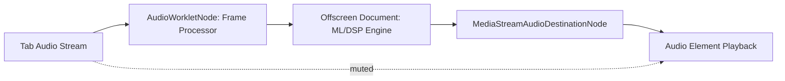

# 🎵 Speech-Only: Real-Time Music Removal Chrome Extension (MV3)

> **Version**: 0.1.0  
> **Date**: 2025-08-15  
> **Author**: Fadl & Abdallah  
> **Status**: Draft / Internal Review

---

## 📋 Table of Contents

- [1. Executive Summary](#1-executive-summary)
- [2. Glossary & Acronyms](#2-glossary--acronyms)
- [3. Goals and Scope](#3-goals-and-scope)
- [4. Architecture Overview](#4-architecture-overview)
- [5. Tech Stack](#5-tech-stack)
- [6. Permissions & Manifest](#6-permissions--manifest)
- [7. Project Structure](#7-project-structure)
- [8. Audio Engine Pipeline](#8-audio-engine-pipeline)
- [9. Popup UI](#9-popup-ui)
- [10. Data Handling & Privacy](#10-data-handling--privacy)
- [11. Performance Strategy](#11-performance-strategy)
- [12. Testing & QA](#12-testing--qa)
- [13. Publishing & Compliance](#13-publishing--compliance)
- [14. Implementation Roadmap](#14-implementation-roadmap)
- [15. Risks & Limitations](#15-risks--limitations)
- [16. Appendices](#16-appendices)

---

## 1. 🎯 Executive Summary

The **Speech‑Only Chrome Extension** is an MV3 browser extension designed to remove or strongly suppress music while preserving speech across all browser audio in real time. It prioritizes high audio quality and adaptive CPU/GPU usage, supports machine learning (ML) for separation, and persists user settings.

**Core Solution**: Captures tab audio, processes it through a Web Audio API graph with ML/DSP algorithms, and plays back the processed audio while muting the original tab.

---

## 2. 📚 Glossary & Acronyms

| Term | Definition |
|------|------------|
| **MV3** | Manifest Version 3 for Chrome Extensions |
| **DSP** | Digital Signal Processing |
| **ML** | Machine Learning |
| **OLA** | Overlap‑Add method for continuous audio reconstruction |
| **STFT** | Short-Time Fourier Transform |
| **ONNX** | Open Neural Network Exchange |

---

## 3. 🎯 Goals and Scope

### 🎯 Primary Goals

- **Remove music while retaining speech** across all browser audio streams
- **Real-time processing** with low latency (<80 ms ML, <40 ms DSP)
- **Adaptive tiering**: ML preferred, DSP fallback
- **UI controls** for sensitivity, speech boost, wet/dry mix, and quality profiles
- **Persist settings** across sessions using `chrome.storage.sync`
- **Full offline processing**; no audio leaves the device

### 🎯 Scope

- **Target platforms**: Chrome MV3 (desktop)
- **Audio sources**: Any tab with sound (YouTube, Twitch, podcasts)
- **Users**: End-users seeking speech clarity in mixed media

---

## 4. 🏗️ Architecture Overview

### 4.1 🔄 High-Level Flow



### 4.2 🧩 Components

| Component | Responsibility |
|-----------|----------------|
| **Service Worker (background)** | Session orchestration, tab capture, offscreen management |
| **Offscreen Document** | ML/DSP engine, audio playback sink |
| **AudioWorkletNode** | Frame-based processing, low-latency metering |
| **Popup UI (React + TS)** | User controls, meters, profile management |
| **Storage** | Persistent settings via `chrome.storage.sync` |

### 4.3 🎚️ Processing Tiers

| Tier | Method | Hardware | Notes |
|------|--------|----------|-------|
| **A** | ML (ONNX Runtime Web) | WebGPU → WebGL → WASM | Preferred for high quality |
| **B** | DSP (FFT, spectral gating, harmonic suppression) | CPU | Fallback when GPU unavailable |

---

## 5. 🛠️ Tech Stack

- **🎨 Frontend**: React + TypeScript + Vite
- **🔌 Extension Build**: Vite + @crxjs/vite-plugin (MV3)
- **🎵 Audio**: Web Audio API, AudioWorklet, MediaStreamAudioDestinationNode
- **🤖 ML**: ONNX Runtime Web (bundled models)
- **⚡ DSP**: FFT, STFT/iSTFT, spectral gating, comb/notch filters
- **💾 State Management**: `chrome.storage.sync`

---

## 6. 🔐 Permissions & Manifest

### 🔑 Permissions

- `tabCapture`, `offscreen`, `storage`, `scripting`, `activeTab`
- **Host permissions**: `<all_urls>`

### 📄 Minimal manifest.json

```json
{
  "manifest_version": 3,
  "name": "Speech-Only: Real-Time Music Removal",
  "version": "0.1.0",
  "action": { "default_popup": "popup/index.html" },
  "permissions": ["tabCapture","offscreen","storage","scripting","activeTab"],
  "host_permissions": ["<all_urls>"],
  "background": { "service_worker": "background/index.js", "type": "module" },
  "web_accessible_resources": [
    { "resources": ["models/**","worklets/**"], "matches": ["<all_urls>"] }
  ]
}
```

---

## 7. 📁 Project Structure

```
speech-only-extension/
├─ 📄 vite.config.ts
├─ 📦 package.json
├─ ⚙️ tsconfig.json
├─ 📁 public/
│  ├─ 🖼️ icons/
│  └─ 🤖 models/
├─ 📁 src/
│  ├─ 🔧 background/
│  ├─ 🎵 offscreen/
│  ├─ 🔊 worklets/
│  ├─ 🖱️ popup/
│  ├─ 🔗 shared/
│  └─ 📝 types/
└─ 📖 README.md
```

---

## 8. 🎵 Audio Engine Pipeline

### 8.1 🎤 Capture

- `chrome.tabCapture.capture({ audio: true })`
- Streams sent to an AudioWorkletNode in offscreen context

### 8.2 ⚙️ Processing

- **Frame-based**: 128–1024 samples per frame
- **Tier selection**: ML if GPU available, DSP fallback
- **Overlap-add reconstruction**

### 8.3 🔊 Playback

- Processed stream routed to `<audio>` element in offscreen
- Original tab muted via `chrome.tabs.update({ muted: true })`

### 8.4 🔄 Frame Processor

AudioWorkletProcessor posts Float32Array frames to offscreen engine

### 8.5 🤖 ML Tier

- ONNX model runs on **WebGPU → WebGL → WASM**
- Produces a speech mask; attenuates music components

### 8.6 ⚡ DSP Tier

- **STFT/iSTFT** with Hann window
- **Harmonic suppression** + spectral gating
- **Speech band emphasis** (300–3400 Hz)
- **Optional compressor/limiter**

---

## 9. 🖱️ Popup UI

### 🎛️ Controls
- **Start/Stop**, **Mode**, **Sensitivity**, **Speech Boost**, **Wet/Dry**, **Quality**, **Scope**

### 📊 Meters
- **Input/Output**, **CPU usage**

### 💾 Persistence
- **Persistent settings** in `chrome.storage.sync`

---

## 10. 🔒 Data Handling & Privacy

- ✅ **All processing local**, no network calls
- ✅ **No raw PCM storage**
- ✅ **Model files bundled** with extension

---

## 11. ⚡ Performance Strategy

- **Latency**: <80 ms (ML), <40 ms (DSP)
- **Adaptive frame size** & overlap
- **Preallocated buffers**, backpressure handling
- **Auto tier/quality adaptation**

---

## 12. 🧪 Testing & QA

### 🧪 Unit Testing
- STFT/iSTFT, mask math

### 🔗 Integration Testing
- End-to-end audio continuity

### 📊 Performance Testing
- Per-frame time telemetry

### 🖱️ Manual Testing
- YouTube, podcasts, Twitch, conferencing

### ⚠️ Edge Cases
- Tab switches, sleep/wake, device changes

---

## 13. 📦 Publishing & Compliance

- **Chrome Web Store packaging** (zip)
- **Permissions and privacy justification**
- **Screenshots, descriptions, versioning**
- **Review checklist**: no network calls, CSP valid, all paths correct

---

## 14. 🗓️ Implementation Roadmap

1. **🏗️ Scaffold** Vite + CRX + TS + React
2. **🔧 Manifest & SW** wiring
3. **📄 Offscreen doc** & pass-through audio
4. **🔊 Worklet framing** + meters
5. **⚡ DSP tier**
6. **🤖 ML tier**
7. **🔄 Adaptive engine**
8. **🎨 UI polish**
9. **🧪 QA/performance**
10. **📦 Store package**

---

## 15. ⚠️ Risks & Limitations

- **High CPU usage** on older laptops using ML
- **GPU unavailable** → fallback to DSP
- **Autoplay policies** may prevent offscreen audio start without user gesture
- **Residual music** may remain in highly complex tracks
- **Browser updates** may break tabCapture behavior

---

## 16. 📚 Appendices

### 16.1 🔧 Sample Frame Processor (Worklet)

```typescript
class FrameProcessor extends AudioWorkletProcessor {
  process(inputs: Float32Array[][]) {
    const frame = new Float32Array(inputs[0][0]);
    this.port.postMessage({ type: 'FRAME', data: frame }, [frame.buffer]);
    return true;
  }
}
registerProcessor('frame-processor', FrameProcessor);
```

### 16.2 🚀 Engine Orchestration (ML/DSP)

```typescript
export class Engine {
  constructor(private tier: 'auto'|'ml'|'dsp') {}
  
  async init() {}
  
  process(frame: Float32Array): Float32Array {
    return this.tier==='ml' ? mlProcess(frame) : dspProcess(frame);
  }
}
```

---

<div align="center">

**📖 Technical Documentation for Speech-Only Chrome Extension**  
*Comprehensive guide for developers and stakeholders*

</div>
